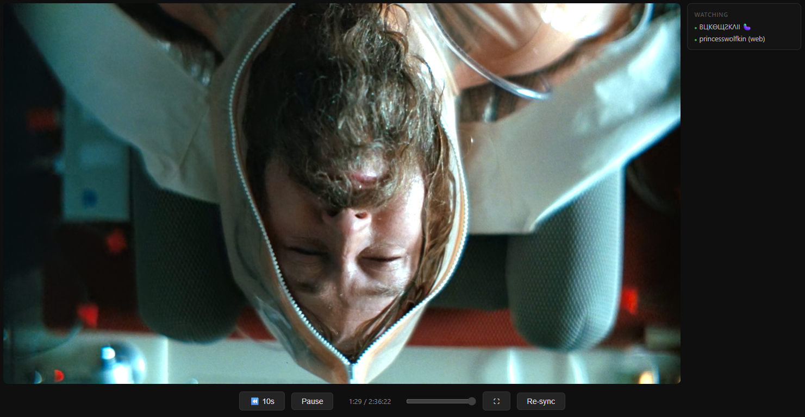
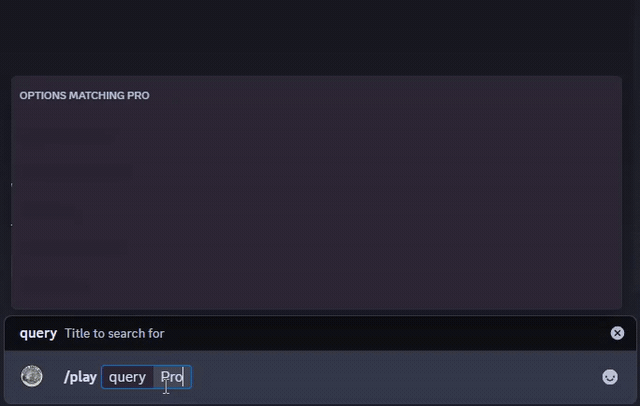
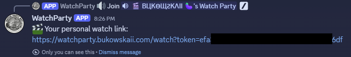
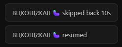
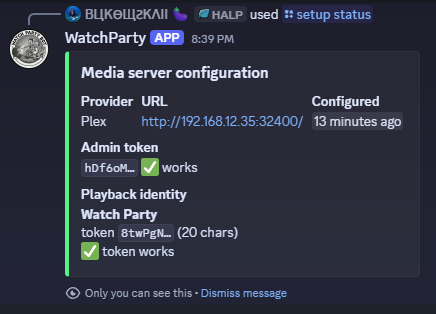

<div align="center">



# DiscordWatchParty

### Self-hosted synchronized watch parties for Discord

[](https://ko-fi.com/bukowskaii)
[](https://github.com/Bukowskaii/DiscordWatchParty/actions/workflows/docker.yml)
[](https://github.com/Bukowskaii/DiscordWatchParty/releases/latest)
[](https://github.com/Bukowskaii/DiscordWatchParty/pkgs/container/discordwatchparty)
[](https://www.gnu.org/licenses/agpl-3.0)
[](https://github.com/Bukowskaii/DiscordWatchParty/stargazers)

*Powered by your own Plex library — one bot, synchronized playback in the browser*

[How it works](#how-it-works) • [Host setup](#host-setup) • [Commands](#commands) • [Security](#security)

</div>

---

## Provider support

| Provider | Status |
|---|---|
| **Plex** | ✅ **Validated** — DASH direct-stream (HEVC passthrough), playback-identity, dashboard/Tautulli reporting |
| Jellyfin / Emby | ⚠️ **Experimental / untested** — code paths exist (HLS) but are not currently validated against a live server |

The features below describe the validated **Plex** experience. Jellyfin/Emby may work via the HLS path but have not been tested in the current build — treat them as unsupported for now.

---

## How it works

1. A guild admin runs `/setup configure` once to connect their Plex server.
2. A member runs `/play <title>`. The bot **creates a voice channel** for the watch party (under a "Watch Parties" category) and posts an embed with the voice channel and a **"Get my watch link"** button.
3. Each viewer taps the button for their **own** watch link (so the party knows who's who), opens it in the browser, and joins the voice channel — playback is synchronized automatically over WebSocket.
4. Pause / resume / skip / back-10s work from both Discord commands and the watch page, apply to everyone in that party, and show a toast of **who** did it.
5. The participant list reflects who's in the voice channel **and** who's watching via their link (web-only viewers are marked).

<p align="center">
  
  <br /><em>Starting a party: <code>/play</code> &rarr; the bot posts the voice channel and a personal-link button.</em>
</p>

<p align="center">
  
  <br /><em>Each viewer taps the button for their own session-scoped link &mdash; only they can see it.</em>
</p>

<p align="center">
  
  <br /><em>Every control action is attributed &mdash; the party sees who paused, skipped, or resumed.</em>
</p>

Each watch party is its own voice channel, so **a single server can run several parties at once** — different groups watching different things. Within one party, everyone shares a single upstream transcode (N viewers ≈ the load of one).

Video is streamed via DASH and proxied through nginx **directly from Plex** — it never passes through Discord or Node.js, and is never stored anywhere.

---

## Host setup

These steps are for the person running the bot. You only do this once.

### Prerequisites

- [Docker](https://docs.docker.com/get-docker/) and Docker Compose
- A way to expose nginx (the `NGINX_PORT` below) publicly over **HTTPS** — a reverse proxy, tunnel, or whatever you already use. Setting that up is out of scope here; you just need the resulting `https://` URL for `PUBLIC_URL`.
- A browser that can decode **HEVC** (Chrome 107+, Edge, or Safari) — same requirement as the Plex web app, since video is direct-streamed as HEVC

### 1. Create a Discord application

1. Go to the [Discord Developer Portal](https://discord.com/developers/applications) and create a new application.
2. Under **Bot**, add a bot and copy the token — this is your `DISCORD_BOT_TOKEN`.
3. Under **General Information**, copy the **Application ID** — this is your `DISCORD_CLIENT_ID`.
4. No privileged intents are required. (The bot uses the *Guild Voice States* intent, which is **not** privileged — no portal toggle needed.)

### 2. Download and configure

Create a directory for the bot and pull down the two files the stack needs — the compose file and the example env file. (Both images, including the nginx config, are published; nothing is built locally.)

```bash
mkdir discordwatchparty && cd discordwatchparty
curl -O https://raw.githubusercontent.com/Bukowskaii/DiscordWatchParty/main/docker-compose.yml
curl -o .env https://raw.githubusercontent.com/Bukowskaii/DiscordWatchParty/main/.env.example
```

Generate an encryption key (used to encrypt stored credentials at rest) and paste it into `.env`:

```bash
openssl rand -hex 32
# prints 64 hex chars — set this as ENCRYPTION_KEY in .env
```

Then open `.env` and fill in the rest:

```env
DISCORD_BOT_TOKEN=        # from step 1
DISCORD_CLIENT_ID=        # from step 1
ENCRYPTION_KEY=           # the `openssl rand -hex 32` output above
PUBLIC_URL=               # the public https:// URL that reaches nginx, e.g. https://watchparty.example.com
NGINX_PORT=8780           # host port nginx listens on; point your public proxy here
# Optional:
# SESSION_TTL_MINUTES=360 # watch-link lifetime (default 6 hours)
```

### 3. Start the bot

```bash
docker compose up -d
```

This pulls and starts two containers, both from published images: **nginx** (public-facing, port 8780, `ghcr.io/bukowskaii/discordwatchparty-nginx`) and the **bot** (internal, not exposed, `ghcr.io/bukowskaii/discordwatchparty`).

> **Slash commands register automatically.** On startup and whenever it joins a new server, the bot registers its `/` commands per-guild (instant, no propagation delay). You do **not** need to run a separate command-deploy step. (A manual `npm run deploy-commands` script also exists, but only from a source checkout — it isn't needed for the image-based setup above.)

### 4. Expose nginx over HTTPS

Point your reverse proxy / tunnel at `http://<host>:8780` (or your `NGINX_PORT`) so it's reachable at the `https://` URL you set as `PUBLIC_URL`. Setting that up is your call — anything that terminates TLS and forwards to nginx works. If you change `PUBLIC_URL` after starting, apply it with:

```bash
docker compose restart
```

### Media server on the same machine?

`localhost` inside Docker refers to the container, not your host. Use your machine's **LAN IP** instead (e.g. `http://192.168.1.100:32400`). Keep this internal — the bot streams Plex segments directly over the LAN, so routing it back out through the public tunnel would be slow and pointless.

---

## Per-server setup (guild admins)

### Invite the bot

Use this URL, replacing `YOUR_CLIENT_ID` with your `DISCORD_CLIENT_ID`:

```
https://discord.com/api/oauth2/authorize?client_id=YOUR_CLIENT_ID&permissions=19472&scope=bot+applications.commands
```

This grants **View Channels, Send Messages, Embed Links, and Manage Channels**. `Manage Channels` is required — the bot creates and deletes a voice channel per watch party. (If you invited an earlier version, re-invite with this URL or add *Manage Channels* to the bot's role, or `/play` will fail to create channels.)

### Connect your Plex server

Run this in your Discord server (requires **Manage Server** permission):

```
/setup configure provider:Plex url:http://192.168.1.x:32400 token:your-plex-token
```

> Find your Plex token: [support.plex.tv/articles/204059436](https://support.plex.tv/articles/204059436-finding-an-authentication-token-x-plex-token/)

The bot tests the connection (and verifies library access) before saving. `/setup status` shows a live health check of the stored credentials.

<p align="center">
  
</p>

### Optional: play under a separate user

By default, playback is attributed to your Plex account in the dashboard and Tautulli. To attribute it to a dedicated user instead:

1. In Plex, create a **Home managed user** (Settings → Users & Sharing → Home) and **share your libraries** with them.
2. Configure it by name — the bot looks up that user's server access token automatically:

```
/setup configure provider:Plex url:... token:... playback-user:Watch Party
```

Use `playback-user:none` to revert to your own account. `/setup status` shows which identity is in use and whether its token works.

> Jellyfin/Emby (`api-key:`) are accepted by `/setup` but, as noted above, are **untested** in the current build.

---

## Commands

| Command | Who | Description |
|---|---|---|
| `/setup configure` | Admins | Connect Plex (and optionally set a `playback-user`) |
| `/setup status` | Admins | Live health check of the configuration (credentials redacted) |
| `/setup remove` | Admins | Remove this server's media configuration |
| `/play <query>` | Everyone | Search (with autocomplete) and queue into your watch party — creates a voice channel if you don't have one |
| `/search <query>` | Everyone | Preview a result (with details) before adding it to the queue |
| `/queue` | Everyone | Show your party's queue and playback position |
| `/pause` · `/resume` | Everyone | Pause / resume your party for all its viewers |
| `/skip` | Everyone | Skip to the next item in your party's queue |
| `/stop` | Everyone | End your party and delete its voice channel |

**Search & TV:** `/play` and `/search` return movies and shows. Pick a show to drill into **seasons → episodes** via menus (paged when there are many). Commands act on the party you're currently in (by voice presence, or the one you started).

**Cleanup:** a party is torn down automatically when its voice channel is empty *and* no one has the watch page open for ~2 minutes, or immediately on `/stop`.

---

## Security

- **Credentials never leave the host.** Stored encrypted (AES-256-GCM) in `data/guild_configs.db` using the `ENCRYPTION_KEY` from your `.env`. The database and the key are useless without each other.
- **Watch links are session-scoped.** Each link contains a random token that expires after `SESSION_TTL_MINUTES` (default 6 hours) and is validated server-side on every request. Sessions are in-memory and reset when the bot restarts.
- **nginx is the only public entry point.** The Node.js bot port is not exposed. The internal auth endpoint (`/_internal/auth`) is marked `internal` and cannot be reached externally.
- **Video bytes never pass through Node.js.** nginx validates the session token, then proxies DASH segments directly from Plex.

**Keep `ENCRYPTION_KEY` backed up separately from `data/`.** If you lose the key, existing configurations cannot be decrypted and admins will need to re-run `/setup configure`.

---

## Updating

Pull the latest published images and recreate the containers:

```bash
docker compose pull
docker compose up -d
# Slash commands re-register automatically on startup.
```

If a release changes `docker-compose.yml` itself (e.g. new services or env vars), re-fetch it first with the same `curl` command as in [Host setup](#2-download-and-configure), then `docker compose up -d`.

---

## AI Assistance

This project was built with the assistance of [Claude](https://claude.ai) (Anthropic). Architecture decisions, feature direction, and code review are driven by the project author. Claude serves as a development accelerator — handling implementation details, debugging, and boilerplate while human judgment guides what gets built and how.
