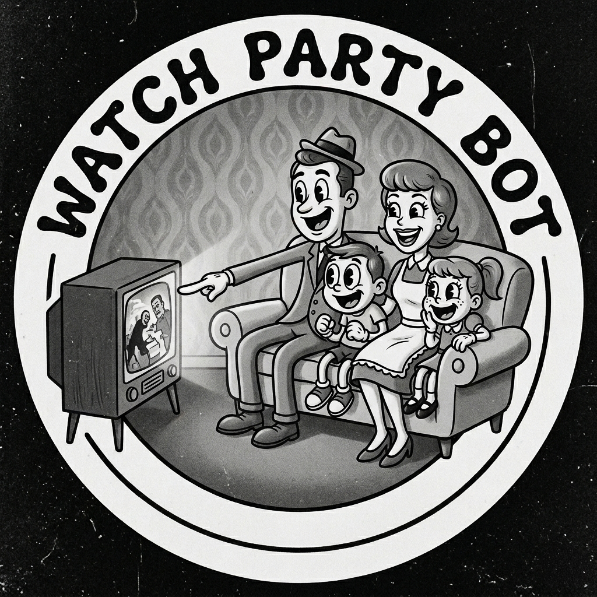

<p align="center">
  
</p>

<h1 align="center">DiscordWatchParty</h1>

<p align="center">
  A self-hosted Discord bot for synchronized watch parties powered by Plex, Jellyfin, or Emby.<br />
  One person hosts the bot. Anyone who adds it to their server brings their own media library.
</p>

---

## How it works

1. A guild admin runs `/setup configure` to connect their Plex, Jellyfin, or Emby server.
2. Members run `/play <title>` to search the library and queue something.
3. The bot posts a watch link in Discord.
4. Everyone opens the link in their browser — playback is synchronized automatically via WebSocket.
5. Pause, skip, and seek controls work from both Discord commands and the watch page.

Video is proxied through nginx directly from the media server — it never passes through Discord and is never stored anywhere.

---

## Host setup

These steps are for the person running the bot. You only do this once.

### Prerequisites

- [Docker](https://docs.docker.com/get-docker/) and Docker Compose
- A [Cloudflare Tunnel](https://developers.cloudflare.com/cloudflare-one/connections/connect-networks/) (or any other way to expose a local port publicly over HTTPS)
- Node.js 20+ (only needed for the one-time command registration step)

### 1. Create a Discord application

1. Go to the [Discord Developer Portal](https://discord.com/developers/applications) and create a new application.
2. Under **Bot**, click **Add Bot**. Copy the token — this is your `DISCORD_BOT_TOKEN`.
3. Under **OAuth2 → General**, copy the **Application ID** — this is your `DISCORD_CLIENT_ID`.
4. Under **Bot**, enable **Message Content Intent** if prompted.

### 2. Clone and configure

```bash
git clone https://github.com/Bukowskaii/DiscordWatchParty.git
cd DiscordWatchParty
npm install
```

Generate an encryption key (used to encrypt guild API keys at rest):

```bash
npm run generate-key
# prints: ENCRYPTION_KEY=<64 hex chars>
```

Copy the example env file and fill it in:

```bash
cp .env.example .env
```

```env
DISCORD_BOT_TOKEN=        # from step 1
DISCORD_CLIENT_ID=        # from step 1
ENCRYPTION_KEY=           # from generate-key above
PUBLIC_URL=               # your Cloudflare Tunnel URL, e.g. https://watchparty.example.com
NGINX_PORT=8780           # port nginx listens on; your tunnel should point here
```

### 3. Register slash commands

This talks to the Discord API and registers all `/` commands globally. Run it once, and again any time commands change.

```bash
npm run deploy-commands
```

### 4. Start the bot

```bash
docker compose up --build -d
```

This starts two containers: **nginx** (public-facing, port 8780) and the **bot** (internal, not exposed).

### 5. Configure Cloudflare Tunnel

In the Cloudflare Zero Trust dashboard, add a public hostname for your tunnel:

| Field | Value |
|---|---|
| Subdomain / domain | e.g. `watchparty.example.com` |
| Service | `http://localhost:8780` (or your `NGINX_PORT`) |

Set `PUBLIC_URL` in your `.env` to that full `https://` URL and restart:

```bash
docker compose restart
```

### Media server on the same machine?

`localhost` inside Docker refers to the container, not your host. Use your machine's **LAN IP** instead (e.g. `http://192.168.1.100:32400`), or uncomment the `extra_hosts` block in `docker-compose.yml` to use `host.docker.internal`.

---

## Per-server setup (guild admins)

### Invite the bot

Use this URL, replacing `YOUR_CLIENT_ID` with your `DISCORD_CLIENT_ID`:

```
https://discord.com/api/oauth2/authorize?client_id=YOUR_CLIENT_ID&permissions=18432&scope=bot+applications.commands
```

### Connect a media server

Run the following in your Discord server (requires **Manage Server** permission):

**Plex**
```
/setup configure provider:Plex url:http://192.168.1.x:32400 token:your-plex-token
```
> Find your Plex token: [support.plex.tv/articles/204059436](https://support.plex.tv/articles/204059436-finding-an-authentication-token-x-plex-token/)

**Jellyfin**
```
/setup configure provider:Jellyfin url:http://192.168.1.x:8096 api-key:your-api-key
```
> Generate an API key: Dashboard → API Keys → +

**Emby**
```
/setup configure provider:Emby url:http://192.168.1.x:8096 api-key:your-api-key
```
> Generate an API key: Settings → API Keys → New API Key

The bot will test the connection before saving. If it fails, double-check the URL is reachable from the internet (or from the bot host's network) and that the credentials are correct.

> **Docker networking note:** If your media server and the bot host are on the same machine, use the host's LAN IP — not `localhost`.

---

## Commands

| Command | Who | Description |
|---|---|---|
| `/setup configure` | Admins | Connect a Plex, Jellyfin, or Emby server |
| `/setup status` | Admins | Show current configuration (API key redacted) |
| `/setup remove` | Admins | Remove this server's media configuration |
| `/play <query>` | Everyone | Search the library and add to the queue |
| `/queue` | Everyone | Show the current queue and playback position |
| `/pause` | Everyone | Pause for all viewers |
| `/resume` | Everyone | Resume for all viewers |
| `/skip` | Everyone | Skip to the next item in the queue |
| `/stop` | Everyone | Stop playback and clear the queue |

---

## Security

- **Credentials never leave the host.** Guild API keys are stored encrypted (AES-256-GCM) in `data/guild_configs.db` using the `ENCRYPTION_KEY` from your `.env`. The database and the key are useless without each other.
- **Watch links are session-scoped.** Each link contains a random token that expires after `SESSION_TTL_MINUTES` (default 6 hours). Tokens are validated server-side on every request.
- **nginx is the only public entry point.** The Node.js bot port is not exposed. The internal auth endpoint (`/_internal/auth`) is marked `internal` in nginx and cannot be reached externally.
- **Video bytes never pass through Node.js.** nginx proxies segments directly from the media server after validating the session token.

**Keep `ENCRYPTION_KEY` backed up separately from `data/`.** If you lose the key, existing guild configurations cannot be decrypted and server admins will need to re-run `/setup configure`.

---

## Updating

```bash
git pull
docker compose up --build -d
# Re-run deploy-commands if any slash commands changed
npm run deploy-commands
```

---

## AI Assistance

This project was built with the assistance of [Claude](https://claude.ai) (Anthropic). Architecture decisions, feature direction, and code review are driven by the project author. Claude serves as a development accelerator — handling implementation details, debugging, and boilerplate while human judgment guides what gets built and how.
